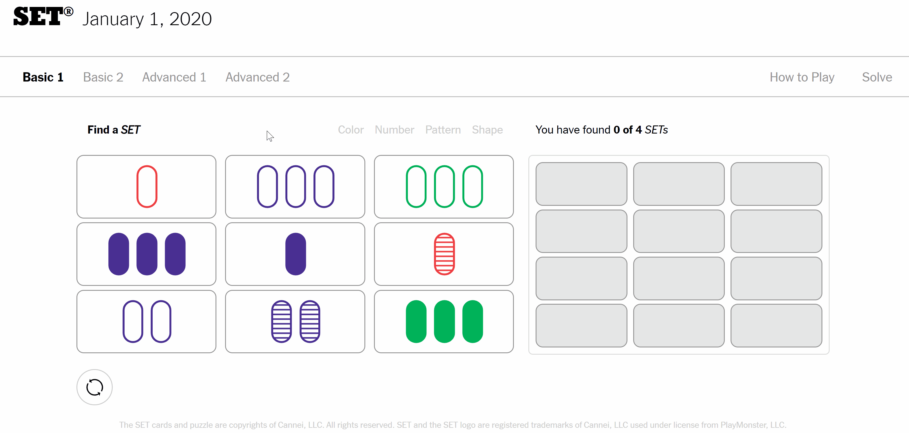

# SET Solver 🚀

Harnessing the power of Web Extension API for solving the SET Game.

## Motivation 💡

The New York Times SET game is a great exercise for the brain, and it's a fun game - unless you are stuck.

SET Solver to the rescue!

### The Rules/Algorithm 📜
 A set consists of 3 cards satisfying all of the following conditions:
> 1. They all have the same number or have 3 different numbers.
> 2. They all have the same symbol or have 3 different symbols.
> 3. They all have the same shading or have 3 different shadings.
> 4. They all have the same color or have 3 different colors.

## Features 🃏

One button - to solve them all.

